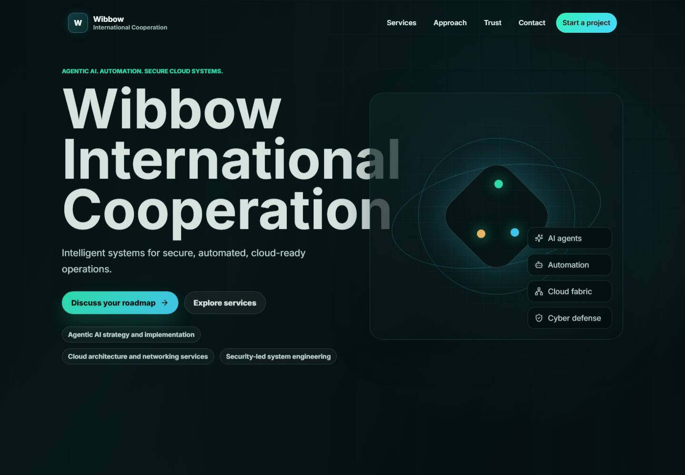
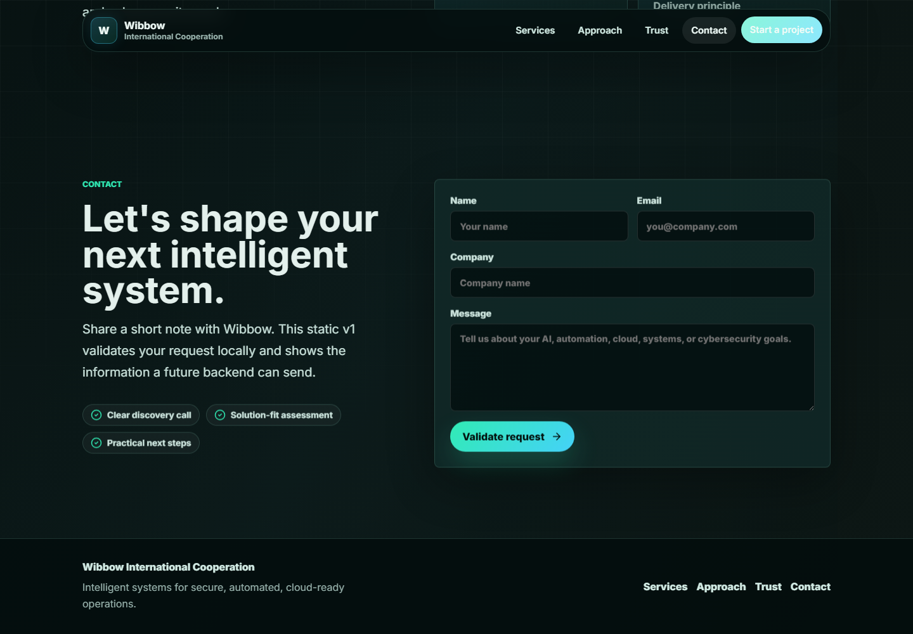
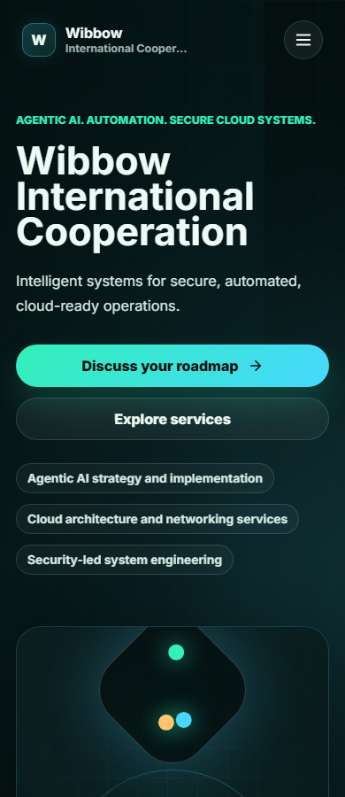

# Wibbow International Cooperation

## Description

A premium single-page React website for a B2B technology partner offering Agentic AI, automation, networking, cloud, system engineering, and cybersecurity services.

## Key Features

- Responsive React/Vite single-page website
- Service, process, trust, hero, and contact sections
- Reusable content model in src/data/siteContent.js
- Local contact-form validation with static success feedback
- Smoke-test and screenshot capture scripts

## Tech Stack

- React
- Vite
- JavaScript
- CSS
- Lucide React
- Node.js

## Installation

npm install

## Usage

Run `npm run dev` for development, `npm run build` for production builds, or `npm run serve` for the static Node.js fallback.

## Screenshots

Additional screenshots can be placed in the `screenshots/` folder.

## License

No license file is currently included. Add a license before reusing, distributing, or publishing this project for public collaboration.

